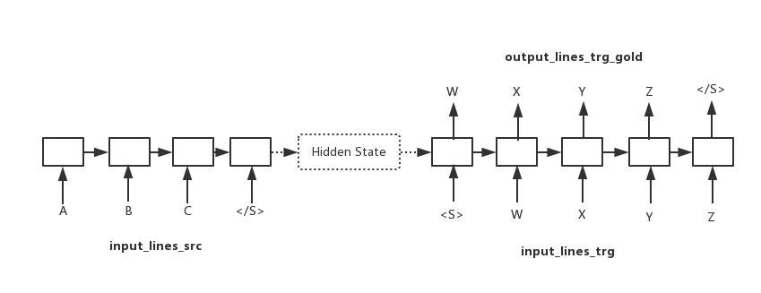

# Seq2Seq models with pytorch
This project is the replication of paper 《Sequence to Sequence Learning with Neural Networks(2014 Ilya Sutskever.etc)》https://arxiv.org/pdf/1409.3215.pdf

## directory file
- readme.md             说明文件
- data                      数据集
- log                        存放日志
- model.py                models
- nmt.py                   main script ro run things
- data_utils.py          data operate file
- evaluate.py             evaluate models

The main idea of the model can be figured as below:

### problems
1. TODO: use beam search to test the model
2. TODO: use better machine to train the model

### Related resources
[1] 机器翻译自动评估-BLEU算法详解: http://blog.csdn.net/qq_31584157/article/details/77709454

